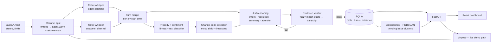

# The Radar Playbook

**Call-Centre Radar — hackathon build plan**

The brief has a trap door built in: *"a claim with no evidence scores zero; evidence that doesn't support the claim scores negative."* Most teams will bolt an LLM onto a transcript and hope its vibes hold up under a judge's click. This plan is built around never needing hope — every mood, intent, and score is produced by something measurable, and a verifier checks its own homework before it reaches the screen.

---

## Why this wins — four bets nobody else will make

**01 — Free, perfect diarization.**
The recordings already separate agent (left channel) from customer (right channel). Most teams will downmix to mono and run error-prone diarization models. We never diarize — we transcribe two mono channels independently and merge by timestamp. Zero speaker-attribution error, by construction.

**02 — The rubric, enforced at runtime.**
Every LLM claim must carry a quote and timestamp. A fuzzy-match verifier checks the quote actually occurs where claimed *before* it's stored. Ungrounded claims are rejected and re-generated, not hoped away — the grading rule becomes a guardrail in the code, not a wish.

**03 — Mood you can measure, not guess.**
Mood comes from a fused score: text sentiment *and* audio prosody (pitch, energy, pace) on the customer channel. The shift point isn't an LLM's opinion — it's a change-point detection algorithm run on the score series, cited by turn.

**04 — A live pipeline, not a lookup table.**
Everything is precomputed for speed, but the ingestion endpoint stays wired up. On demo day, feed it a recording nobody has seen — watch transcription, mood, intent, and the attention score materialize live.

---

## Architecture

One pipeline, run once per call and cached; one API surface reading only from storage; one dashboard consuming that API. The ingestion path is reusable for the live-demo "new recording" moment.



---

## Half one — turn recordings into usable text

### Stage 1 · ASR — channel-split transcription

`ffmpeg` splits each stereo file into `agent.wav` and `customer.wav`, resampled to 16 kHz for the ASR model. Each mono channel is transcribed independently with **faster-whisper** (CTranslate2, word-level timestamps, VAD-filtered). Because each channel is single-speaker by construction, there is no diarization error to inherit.

Merge step: take both channels' segments, sort by start time, and collapse consecutive same-speaker segments into turns. Segments that genuinely overlap in time (interruptions, talk-over) are kept as overlapping turns and flagged — don't force a false sequential order onto real crosstalk.

| Model tier | When to use it | Why |
|---|---|---|
| `distil-whisper small` / `faster-whisper small.en` (int8) | CPU-only, first full pass over all 1,441 calls | Fast enough to finish overnight; telephony speech is clear enough that quality loss is small |
| `faster-whisper large-v3` (int8 or fp16) | GPU available, or a second targeted pass | Best accuracy — worth spending on calls flagged high-attention or used in the eval set |

> **Do this on day one, not day three.** Run the full pipeline on 20 calls first and time it. That number tells you whether all 1,441 calls fit in an overnight CPU batch or whether you need the small-model first pass + selective large-model refinement plan. Deciding this on faith wastes a day you don't have back.

#### Provider strategy: AssemblyAI primary, faster-whisper fallback

A $49 AssemblyAI free-tier credit changes the calculus for Stage 1 specifically. AssemblyAI accepts dual-/multichannel audio natively and returns per-word timestamps with speaker labels in a single call — for ~120 hours of audio across 1,441 calls, that's well inside the credit, and it removes a day or more of channel-split/alignment engineering.

Put this behind a `Transcriber` interface with two implementations, selected by config, not by rewrite:

```python
class Transcriber(ABC):
    def transcribe_channel(self, wav_path: str, speaker: str) -> list[Segment]: ...

class AssemblyAIProvider(Transcriber): ...   # primary — spends the credit
class WhisperProvider(Transcriber): ...      # fallback — fully offline, fully open source
```

Why keep both, not just switch:

- **Demo-day risk.** A paid external API going slow or rate-limited live in front of judges is not a risk worth taking for the one moment (`/ingest` on a never-seen recording) that's supposed to be the wow moment. `WhisperProvider` is the safety net for that exact minute.
- **A README that actually runs from scratch.** Anyone grading this without your AssemblyAI key can still clone the repo and run the whole pipeline offline on `WhisperProvider` — the "runs from scratch" requirement in the brief shouldn't depend on your credit balance.
- **Don't spend the credit on judgments, only on transcription.** Skip AssemblyAI's built-in Sentiment Analysis / Auto Chapters / Summarization add-ons even though they're one checkbox away. Those judgments aren't grounded to a citation *you* control, and the entire architecture exists so that every mood/intent/resolution claim is grounded and verified by your own code. Buy the transcript and speaker labels; keep the intelligence layer yours.

Budget guardrails: sum actual audio duration across the dataset (`ffprobe`) before spending anything; run 15-20 calls through the API first and check real per-minute cost on the dashboard; cache every response immediately so a re-run never re-spends credit on the same call.

### Stage 2 · Signal extraction — mood as a measured time series

Per customer turn: a text-sentiment score (a small local classifier, e.g. an English emotion model) fused with prosodic features pulled from the raw audio with `librosa` — pitch variance, energy, speaking rate, pause length. The fusion weights are simple and documented, not a black box.

The resulting score series is fed to `ruptures` (PELT change-point detection) to find the statistically real point where the trend breaks — that turn's timestamp and exact words become the shift evidence. This is the same series that draws the mood timeline in the UI, so the chart and the "why" are the same computation.

### Stage 3 · Grounded reasoning — intent, resolution, summary, attention

A locally-served open model (Llama 3.1 8B / Qwen2.5, via Ollama) is forced into a strict JSON schema where every judgment field carries a nested `evidence` object — no free-floating claims are structurally possible.

```json
{
  "intent": {"label": "dispute a duplicate charge",
             "evidence": {"turn": 4, "t": "00:00:41",
                           "quote": "I was charged twice for the same order"}},
  "resolution": {"status": "unresolved",
                 "evidence": {"turn": 38, "t": "00:06:12",
                               "quote": "I still don't have a refund date"}},
  "summary": "Customer disputes a duplicate charge; agent opens a case but gives no refund timeline. Unresolved.",
  "needs_attention": {"score": 82,
    "factors": [
      {"factor": "unresolved billing dispute", "weight": 0.4},
      {"factor": "mood shift to sustained frustration", "weight": 0.35,
       "evidence": {"turn": 12, "t": "00:01:58", "quote": "this is the third time I've called about this"}},
      {"factor": "escalation language: \"speak to a manager\"", "weight": 0.25,
       "evidence": {"turn": 41, "t": "00:06:40", "quote": "I want to speak to a manager"}}
    ]}
}
```

The `needs_attention` score is *computed*, not asked-for as a number: mood severity, mood volatility, resolution status, an escalation-keyword lexicon, handle-time outliers, and repeat-contact-for-the-same-issue each contribute a weight. The LLM narrates the factors; it doesn't invent the arithmetic.

> **The part nobody else will build.** Before any evidence object is stored, a verifier fuzzy-matches (`rapidfuzz`) the quoted text against the actual transcript within a window around the claimed timestamp. Below a match threshold, the claim is rejected and regenerated — or surfaced to the dashboard as **unverified** rather than silently kept. The brief's scoring rule is implemented as code, not trusted to a prompt.

### Stage 4 · Cross-call intelligence

Call summaries are embedded (`sentence-transformers`, all-MiniLM) and clustered with HDBSCAN — no predefined issue taxonomy, so genuinely emergent trends surface. Cluster frequency bucketed by day drives the trending view. The same clustering flags repeat contacts: same customer, same cluster, within N days, which folds back into that call's attention score. Per-agent volume, handle time, and resolution rate are plain SQL rollups over the stored analysis.

---

## Half two — the intelligence, made checkable

Every judgment on screen is a claim plus a chip. Clicking a chip seeks the audio player to that timestamp and highlights the quoted words in the transcript — a judge can verify any claim in two clicks, which is exactly what the brief is asking for.

```
customer  00:01:58  "This is the third time I've called about this exact charge."   [◐ mood shift]
agent     00:02:04  "I understand — let me open a new case for you."
customer  00:06:40  "I want to speak to a manager."                                 [◐ escalation]

  [unresolved]   [attention 82]
```

---

## API surface

| Endpoint | Returns |
|---|---|
| `GET /customers` | Every customer by name, call count, last contact date |
| `GET /customers/{id}/calls` | That customer's full call history |
| `GET /calls/{id}` | Turns with speaker + timing, intent, mood timeline + shift, resolution, ≤40-word summary, attention score + factors — each with evidence |
| `GET /attention?date=` | Ranked "needs a manager today" list |
| `GET /trends` | Issue clusters with time-bucketed frequency |
| `GET /agents` | Per-agent volume, handle time, resolution rate |
| `POST /ingest` | Runs the full pipeline on a new recording — the live-demo path |

Storage is SQLite: precomputed once at ingestion, read-only at request time, zero server setup for whoever runs the README. Upgrading to Postgres later is a one-line connection-string change if the team wants the production feel — not required to satisfy the brief.

---

## Tech stack — open source, end to end

| Layer | Tool | License | Why this one |
|---|---|---|---|
| ASR (primary) | AssemblyAI API | Commercial ($49 free credit) | Native multichannel transcription + speaker labels + word timestamps in one call — spends the credit on the commodity step, not the differentiator |
| ASR (fallback / offline) | `faster-whisper` | MIT | CTranslate2 backend — keeps the repo runnable with zero API key, and is the safety net if AssemblyAI is slow/down during the live demo |
| ASR fallback | `distil-whisper` | Apache-2.0 | ~6× faster first pass if the full-model timing doesn't fit |
| Local LLM | Ollama + Qwen2.5 / Llama 3.1 | Apache-2.0 / Llama license | Zero API cost, zero network dependency on demo day |
| Audio features | `librosa` | ISC | Pitch, energy, speaking rate for the prosody half of mood |
| Change-point detection | `ruptures` | BSD-3 | Principled mood-shift point, not a guessed inflection |
| Evidence verification | `rapidfuzz` | MIT | Fast fuzzy string match — the rubric-enforcer |
| Embeddings | `sentence-transformers` | Apache-2.0 | Local, small, good enough for clustering short summaries |
| Clustering | HDBSCAN | BSD-3 | No fixed number of issue categories — trends emerge from the data |
| Backend | FastAPI + SQLite | MIT / Public domain | One process, one file database, auto-generated OpenAPI docs |
| Frontend | React + TypeScript + Tailwind | MIT | Fast to build, easy to hand off between teammates |
| Waveform + charts | wavesurfer.js + Recharts | BSD-3 / MIT | Playable waveform synced to transcript; mood timeline overlay |
| Eval | `jiwer` | Apache-2.0 | Word-error-rate scoring against a small hand-checked gold set |

---

## The evaluation harness — prove it, don't claim it

Hand-check 20–30 calls against the actual audio: word error rate for the transcript (`jiwer`), and — more importantly — the verifier's own catch rate on evidence quotes (how many generated citations actually match the transcript at the claimed timestamp). Put these numbers on a slide. "94.2% WER-adjusted accuracy, 100% of shown citations passed verification" is a claim a judge can't wave away, and almost no other team will have measured anything at all.

---

## Build sequence — one week, two to three people

| Day | Focus | Owner(s) |
|---|---|---|
| 1 | Listen to a sample of calls, confirm the metadata schema, scaffold the repo and Docker Compose, run the 20-call throughput test to pick ASR model sizes | All |
| 2 | ASR pipeline end to end: channel split → per-channel transcription → turn merge on the sample set. DB schema + FastAPI skeleton in parallel | Person A / Person B |
| 3 | Kick off the full 1,441-call transcription run in the background. Build prosody + sentiment + change-point mood scoring against calls already done | Person A |
| 4 | LLM schema for intent / resolution / summary / attention, wired to the evidence verifier. Wire results into storage as the batch run completes | Person B |
| 5 | Embedding + clustering for trending issues, repeat-contact detection, per-agent rollups, "needs attention today" ranking. Finalize every API endpoint | Person B |
| 6 | Dashboard: customer list, call history, per-call view (waveform + synced transcript + mood timeline + evidence chips), attention/trends/agent dashboards | Person C |
| 7 | Run the eval harness, wire the live `/ingest` path for a never-seen recording, finish the README, rehearse the demo script twice, keep a buffer for whatever breaks | All |

---

## Demo script — live in front of judges

1. **Open with the rule itself.** Put the brief's own sentence on screen — "a claim with no evidence scores zero" — then show that every card in your dashboard already carries a clickable citation.
2. **Explain the channel-split insight in one breath.** Left is the agent, right is the customer — so there's no diarization to get wrong, just two transcripts merged by clock time.
3. **Take a judge's chosen call.** Click the mood timeline's shift point, hear the exact three seconds of audio that caused it.
4. **Feed it a recording nobody has seen.** Run `/ingest` live and watch transcription, mood, intent, and attention score appear in real time — proof this isn't a lookup table.
5. **Show a real trend.** Point at an issue cluster that actually recurs in the data and click through to the calls behind it.
6. **Close on the numbers.** WER and citation-verification rate from the eval harness — an accuracy claim a judge can't dismiss as marketing.

---

## Risks & fallbacks

| Risk | Fallback |
|---|---|
| 1,441 calls too slow to transcribe on available compute | AssemblyAI handles the full batch inside the $49 credit; small/distil `faster-whisper` first pass as the offline fallback |
| AssemblyAI credit runs low or the API is down during the live demo | `Transcriber` interface swaps to `WhisperProvider` with a config change, no code rewrite mid-demo |
| Local LLM too slow or inconsistent on structured output | Fall back to a smaller model with stricter grammar-constrained decoding (e.g. `outlines`); reduce fields per call before dropping the evidence requirement |
| Verifier rejects too many claims, stalling the batch | Loosen the fuzzy-match threshold slightly and log the rejection rate — it's a real number to report either way |
| Live `/ingest` demo call takes too long on stage | Have it running in the background before you start talking; narrate the architecture while it finishes |

---

*Built for the Call-Centre Radar hackathon brief — 1,441 calls, evidence-or-zero scoring, an admin dashboard over the intelligence.*
