# Call-Centre Radar

Raw stereo call recordings in, a grounded API and admin dashboard out. Every
judgment the system makes — intent, mood shift, resolution, needs-attention
score — carries the timestamp and the words that justify it.

**The design rule: the model is never allowed to write a quote.** It cites a
turn by *number*, under an enforced JSON schema, and the exact words are looked
up from our own transcript. Fabricated citations aren't detected after the fact
— they're structurally impossible to express.

See [RADAR_PLAYBOOK.md](RADAR_PLAYBOOK.md) for the architecture and the
reasoning behind each choice.

---

## Where each requirement lives

| The brief asks for | Dashboard | API |
|---|---|---|
| Every customer by name, with full call history | `/customers` | `GET /customers`, `GET /customers/{id}/calls` |
| Per call: the recording and our transcript | `/calls/{id}` | `GET /calls/{id}` |
| Per call: intent, mood + where it shifted, resolution, ≤40-word summary | `/calls/{id}` | `GET /calls/{id}` |
| Needs-attention today, ranked | `/attention` | `GET /attention?date=` |
| Which issues are trending | `/trends` | `GET /trends` |
| Per-agent volumes, handle times, outcomes | `/agents` | `GET /agents` |
| A judgment cites the timestamp and the words | everywhere a claim appears | `evidence` on every judgment field |

Two views go past the brief: `/` is a single-screen control room across all
four days, and `/repeat-contacts` surfaces customers who called three or more
times about the same issue — the brief's own example of "the complaint that
came up nine times this week".

Measured on the shipped database, so these are checkable rather than claimed:

- **1,441/1,441** calls have an intent, a resolution and a mood series
- **18,025** turns carry speaker and timings
- Longest summary is **30 words** (the cap is 40); no call exceeds it
- Needs-attention scores span **0–40**, inside the required 0–100
- **2,961** citations at **89.4%** verified — see [Evaluation](#evaluation)

Nothing is transcribed on request: the analysis is precomputed into
`data/radar.db`, and `POST /ingest` is the one path that runs the pipeline live,
for a recording the system has never seen.

---

## Quickstart

**The analysed database ships with this repo.** `data/radar.db` contains all
1,441 calls already transcribed and analysed, so you can skip straight to
serving — no API keys, no cost, no waiting:

```bash
cp .env.example .env
unzip callradar-data.zip -d data/     # audio only; needed for playback
docker compose up backend frontend
```

- Dashboard: **http://localhost:3000**
- API docs: **http://localhost:8000/docs**

`data/cache/` also ships with the raw transcripts, so the analysis layer can be
re-run without paying to transcribe again:

```bash
docker compose run --rm --no-deps backend python scripts/analyze_dataset.py --reanalyze --workers 8
```

---

## Rebuilding from scratch

To regenerate everything from the raw audio, delete `data/radar.db` and
`data/cache/`, then fill in **two** keys in `.env`:

| Variable | For | Getting one |
|---|---|---|
| `ASSEMBLYAI_API_KEY` | transcription | [assemblyai.com](https://www.assemblyai.com) — free credit covers the whole corpus (~$7) |
| `GROQ_API_KEY` | reasoning | [console.groq.com](https://console.groq.com) — free, no card |

```bash
# 1. transcribe — once, cached to data/cache/, never repeated
docker compose run --rm --no-deps backend python scripts/ingest_dataset.py --workers 8

# 2. analyse — mood, reasoning, verified citations, attention, clustering
docker compose run --rm --no-deps backend python scripts/analyze_dataset.py --workers 8

# 3. serve
docker compose up backend frontend
```

Expect roughly **80 minutes** for step 1 and **15 minutes** for step 2.

> **After editing `.env`, run `docker compose up -d --force-recreate backend`.**
> `docker compose restart` does *not* reload environment files, and the symptom
> is a provider error naming credentials you already fixed.

---

## How it works

Seven stages. The first three turn audio into text; the rest turn text into
judgments that can be checked.

```mermaid
flowchart LR
    subgraph S1["1 · Audio → text  (expensive, cached, runs once)"]
        direction TB
        MP3["call.mp3<br/>stereo, 8 kHz"]
        SPLIT["ffmpeg channelsplit<br/><b>left = agent · right = customer</b><br/>this is the whole of diarization"]
        ASR["AssemblyAI multichannel<br/>faster-whisper offline fallback"]
        CACHE[("data/cache/<br/>raw transcripts")]
        TURNS["merge_into_turns<br/>split on 0.8s pauses"]
        MP3 --> SPLIT --> ASR --> CACHE --> TURNS
    end

    TURNS --> DB[("SQLite<br/>turns")]

    subgraph S2["2 · Text → judgments  (free, re-runnable)"]
        direction TB
        LLM["reasoning.py<br/>enforced JSON schema<br/><b>returns turn_id, never a quote</b>"]
        LOOKUP["quote read back<br/>from our own turns"]
        SPAN{"span<br/>rapidfuzz ≥ 85"}
        SUPP{"support<br/>bge-small ≥ 0.42"}
        EV[("evidence<br/>verified 0 or 1")]
        LLM --> LOOKUP --> SPAN
        SPAN -->|pass| SUPP
        SPAN -->|fail| EV
        SUPP -->|pass| EV
        SUPP -->|fail| EV
        MOOD["mood.py<br/>VADER 0.7 + prosody 0.3"]
        CP["ruptures PELT<br/>change point"]
        MOOD --> CP
        CLUSTER["clustering.py<br/>bge → HDBSCAN → c-TF-IDF"]
    end

    DB --> LLM
    DB --> MOOD
    DB --> CLUSTER

    CP --> SCORE["attention_score.py<br/>computed from published weights<br/>the model never supplies the number"]
    EV --> SCORE

    subgraph S3["3 · Serve"]
        direction TB
        API["FastAPI"]
        UI["Next.js dashboard"]
        REVIEW["manager review<br/>append-only log"]
        API --> UI --> REVIEW
    end

    SCORE --> API
    EV --> API
    CLUSTER --> API
    REVIEW -.->|"queues re-filter"| API

    LIVE["POST /ingest<br/>a call nobody has seen"] -.->|"same pipeline · ~13s"| MP3
```



Transcription is the only expensive, irreversible step, so it is cached and
happens once; everything to the right of `data/cache/` re-runs for free.

### 1. Split the channels — this *is* the diarization

The recordings are stereo with the agent on the left and the customer on the
right, so `ffmpeg` splits them into two mono files and attribution is finished.
No diarization model, no speaker-clustering step, and therefore no diarization
error: who spoke is a property of the file, not a prediction.

```
[0:a]channelsplit=channel_layout=stereo[left][right]   ->  agent.wav, customer.wav
```

### 2. Transcribe each channel separately

AssemblyAI with `multichannel=True` — *not* `speaker_labels`, which would ask
it to re-derive a fact we already have. `faster-whisper` is the offline
fallback and needs no key.

Every response is cached to `data/cache/{call_id}.{provider}.json` before
anything else touches it. Transcription is the only expensive, irreversible
step, so it happens exactly once; every later change re-runs against the cache.

### 3. Reconstruct turns from word timestamps

ASR segments are not conversational turns — a whole side of a call can arrive
as one blob. Turns are rebuilt from word-level timings: a silence longer than
**0.8s** inside one speaker's audio ends their turn, then both sides are
interleaved by start time. The same constant splits and re-joins, so the two
operations are exact inverses.

### 4. Mood, per customer turn

VADER lexicon sentiment (deterministic, no model download, and you can point at
the word that moved a score) fused **0.7 / 0.3** with prosody derived from the
word timestamps — speaking rate and pause structure. Turns under 5 words are
left unscored rather than guessed at.

Change points in that series are found with `ruptures` PELT. A detected change
is only *reported* as a mood shift if the customer ends up genuinely negative,
not merely lower than they started — see "Known characteristics" below for why
that filter carries most of the weight on this corpus.

### 5. Grounded reasoning — the model never writes a quote

One call to the LLM per call, under an enforced JSON schema, for intent,
resolution and the summary. **The schema has no `quote` field.** It cannot: it
only accepts a `turn_id`.

```jsonc
"intent": {
  "label":   "string",   // what the customer wanted
  "turn_id": "integer"   // which turn shows it — a NUMBER, never text
}
```

The words are then looked up from our own transcript by that id. A fabricated
quote is not caught after the fact — it is unrepresentable, because there is no
field the model could put one in.

### 6. Verify every citation, twice

Two questions, and most systems only ask the first:

| Check | Question | How |
|---|---|---|
| **Span** | Does this quote occur in the cited turn? | `rapidfuzz`, ≥85/100, minimum 5 words |
| **Support** | Does it *justify the claim being made*? | `bge-small` embeddings via `fastembed`, ≥0.42 |

A real quote that does not support its claim is the failure the brief scores
**negative**, and a single green tick hides it. Both scores are stored, and the
dashboard's `why?` toggle shows the working.

Both thresholds were **calibrated, not guessed**: on labelled pairs, unrelated
quotes scored 0.259–0.400 and supporting ones 0.434–0.808, so the cut is 0.42.
The lexical fallback was originally guessed at 0.62 — above most of the
supporting range — and was silently rejecting genuine citations until it was
measured and moved to 0.45.

Two claim types get the span check only: `mood_shift` and `attention_factor`
point at turns chosen by *our own arithmetic*, so their citation means "these
are the words at the moment the number came from", which is true by
construction. Entailment-checking a number against the turn it was derived from
is circular — it scored 0/11 before this exception existed.

### 7. Score, cluster, and rank

The needs-attention score is **computed, not asked for**. The model narrates
what went wrong; `attention_score.py` owns the arithmetic, from weights that
are published in the file and shown in the UI:

| Factor | Max |
|---|---:|
| Issue unresolved | 0.30 |
| Sustained negative mood | 0.20 |
| Explicit escalation language | 0.20 |
| Mood turned negative mid-call | 0.15 |
| Repeat contact, same issue | 0.10 |
| Unusually long call | 0.05 |

Asking a model for a number gives you a different number on Tuesday, and "the
model said 82" cannot be audited or tuned. Because the weights are additive,
the UI can also show what the score would be *without* each factor — which is
the question a manager actually has.

Issues are discovered, not predefined: intent + summary embedded with
`bge-small`, clustered with `sklearn`'s HDBSCAN, and named from **c-TF-IDF** —
the terms frequent inside a cluster and rare outside it. The terms are stored
alongside the readable name, so "no taxonomy was supplied" stays verifiable
rather than asserted.

### Where the human fits

Triage is an append-only log, not a status flag. Marking a call reviewed takes
it out of the queues; reopening appends a reversal rather than deleting the
closure, so the record of who closed what, when and why survives being undone.

It never writes to `resolution_status` — that is the model's judgment and the
input to every resolution rate on the dashboard. If a manager's click reached
it, those numbers would quietly stop describing the call centre and start
describing who clicked what.

---

## Reasoning providers

Any provider works as long as it enforces a **JSON schema** — that enforcement
is what makes the citation guarantee hold. A provider offering only "valid
JSON" without schema adherence silently breaks the design.

| `LLM_PROVIDER` | Model | Notes |
|---|---|---|
| `groq` | `openai/gpt-oss-20b` | **Default.** Free, fast. Free tier caps at 8k tokens/min and 1k requests/day — fine for `/ingest`, ~3 hours for a full batch |
| `bedrock` | `openai.gpt-oss-120b-1:0` | No rate ceiling. Needs AWS credentials and account verification |
| `azure` | your deployment | Set endpoint, key, deployment name, and a recent `api-version` |
| `ollama` | `qwen3:8b` | Fully offline — see below |

Switching is one line in `.env`. Nothing else changes.

### Fully offline

No API keys, no network, nothing to pay:

```bash
# in .env
TRANSCRIBER_PROVIDER=whisper
LLM_PROVIDER=ollama

docker compose --profile offline up -d ollama
docker compose exec ollama ollama pull qwen3:8b
```

Transcription then takes ~2.5 hours on 12 CPU cores instead of ~80 minutes.

---

## Live ingestion

The **"Analyse a call"** tab (http://localhost:3000/ingest) takes a drag-and-drop
upload, runs the whole pipeline, and opens the finished call with its transcript,
mood timeline and evidence chips already populated.

`POST /ingest` is the same thing from the API — the **same pipeline** the batch
uses (split, transcribe, merge, mood, reasoning, verified citations, attention
score), returning the full analysed call:

```bash
curl -X POST http://localhost:8000/ingest \
  -F "audio=@new-call.mp3" \
  -F "customer_name=Priya Sharma" \
  -F "agent_name=Daniel"
```

Takes ~17s warm. The audio must be **stereo** (left = agent, right =
customer); a mono upload is rejected with an explanation rather than silently
mis-attributed.

> Warm the pipeline with one throwaway ingest before demoing — the first call
> in a fresh container loads the embedding model and takes noticeably longer.

---

## Useful flags

```bash
# time 20 calls before committing to the full run
... ingest_dataset.py --limit 20

# re-run turn merging from CACHED transcripts — no re-transcription, no spend
... ingest_dataset.py --reprocess

# re-run the intelligence layer without touching audio
... analyze_dataset.py --reanalyze

# rebuild issue clusters only
... analyze_dataset.py --cluster-only
```

Transcription and analysis are separate scripts on purpose: transcription is
slow and paid and happens once; analysis is fast and free and gets re-run
constantly while prompts and weights are tuned.

---

## Evaluation

```bash
docker compose run --rm --no-deps backend python scripts/eval_harness.py
```

Reports the **citation pass rate** — what fraction of stored citations actually
occur in the cited turn *and* semantically support the claim — broken down by
claim type, with rejection reasons. Fully automatic, no labelling required.

Measured on the full corpus:

| Claim type | Citations | Verified | |
|---|---:|---:|---:|
| Intent | 1,441 | 1,411 | **97.9%** |
| Resolution | 1,441 | 1,169 | 81.1% |
| Mood shift | 68 | 56 | 82.4% |
| Attention factor | 11 | 10 | 90.9% |
| **Overall** | **2,961** | **2,646** | **89.4%** |

Across 1,441 calls. Resolution is the hardest claim type and that is expected:
it is a judgment about what *didn't* happen — a payment never confirmed — and
the turn where nothing was said is the turn hardest to cite.

"Verified" means the quote provably occurs in the cited turn **and**
semantically supports the claim. The harness re-checks from scratch rather than
trusting the stored flag, so the number can't drift from what the dashboard
shows.

Word error rate also runs if you place hand-checked `{call_id}.txt` transcripts
in `eval/gold_set/` and `pip install -r backend/requirements-ml.txt`.

---

## Project layout

```
backend/    FastAPI service + the transcription/analysis pipeline
frontend/   Next.js (App Router) dashboard
data/       audio/, metadata/, plus generated cache/ and radar.db
eval/       hand-checked gold set for WER
```

The browser never calls FastAPI directly: `next.config.ts` rewrites `/api/*`
and `/audio/*` to the backend, so there's no CORS configuration anywhere and
the audio player's HTTP Range requests stay same-origin.

## Tests

```bash
docker compose run --rm --no-deps backend python -m pytest tests/ -q
```

---

## Known characteristics of this dataset

Worth knowing before reading the dashboard — several shaped the design:

- **1,441 calls, 23.28 hours.** Mean call 58s. All stereo 8 kHz: left channel
  agent, right channel customer, which is why no diarization is needed.
- **Only 4 distinct days** (2020-03-15, 05-30, 06-01, 06-02). "Attention today"
  therefore means *the most recent day that has calls*, not `DATE('now')`. And
  the Trends view ranks by volume and outcome rather than drawing a time series
  over four non-contiguous points — per-day counts there reproduce the
  recording schedule, not any trend.
- **`speaker_id` is not a person.** One customer name maps to 14 different
  speaker_ids. Identity is keyed on name — see `pipeline/metadata.py`.
- **The calls are scripted and polite.** The escalation lexicon fires on
  essentially none of them, so that attention factor rarely contributes and
  scores top out around 55 rather than 90.
- **Mood shifts are reported conservatively.** Change-point detection runs on a
  partly prosodic signal, so it fires on rhythm changes in speech with no
  emotional content — a customer reading out an address. Where the shift turn is
  too short to quote, the system reports *no shift* rather than a claim it
  cannot evidence. That cut shift claims from 451 to 177 and took their
  verification rate from 33% to 86%.
