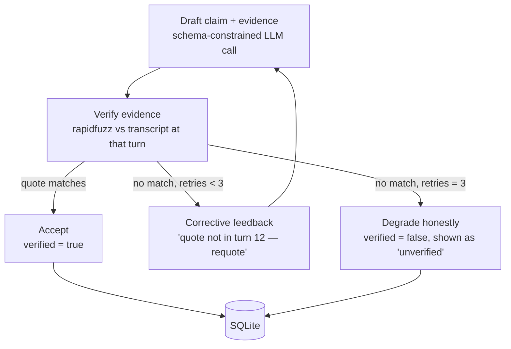

# The Reasoning Layer — What We're Building and Why

> ## Outcome: we took the fallback documented at the end of this file.
>
> **The shipped system uses neither LangGraph nor LangChain.** This document is
> the design record that led to that decision, kept because the reasoning still
> explains the code — not because it describes what was built.
>
> The "Fallback if time runs short" section below called it correctly: the
> retry-and-degrade behaviour is the differentiator, the framework was only a
> tidy home for it. That behaviour lives in
> [`backend/app/pipeline/reasoning.py`](backend/app/pipeline/reasoning.py) as a
> plain loop over four providers, and the citation guarantee it protects is
> unchanged — the model returns a turn *number* under an enforced JSON schema,
> and the words are looked up from our own transcript.
>
> What we gave up: the per-field retry and the diagram. What we kept: the
> correctness guarantee, and one fewer dependency to explain.
>
> Read the rest as *why the problem is shaped this way*, and see
> [RADAR_PLAYBOOK.md](RADAR_PLAYBOOK.md) for the architecture as built.

---

**Original short answer (superseded): LangGraph — yes. LangChain — only one thin slice of it. Not both fully.**

This doc explains the problem in plain language first, then the decision, then
the code. If you only read one section, read "The problem in one example."

---

## The problem in one example

The brief says:

> *"Every judgment must cite the moment in the call that justifies it — a
> timestamp, and the words spoken there. A claim with no evidence scores
> **zero**. Evidence that does not support the claim scores **negative**."*

So it's not enough for our dashboard to say *"customer was frustrated."* It has
to say *"customer was frustrated — at 00:01:58 they said 'this is the third
time I've called about this.'"*

Now here's the danger. We're asking an AI to write those claims for 1,441 calls,
unattended. AI models sometimes produce a quote that *sounds* right but isn't
what was actually said. Real example of the failure:

| | |
|---|---|
| **AI claims** | Intent: refund request. Evidence @ 00:01:40 — *"I want my money back right now."* |
| **Actually said at 00:01:40** | *"I already paid for this order twice."* |
| **Score under the brief** | **Negative.** Worse than if we'd said nothing at all. |

A judge clicks the citation, sees it doesn't match, and we lose points *live*.
This can happen silently, once per call, 1,441 times. **This is the single
biggest risk in the entire project.**

## The solution in plain language

Like a strict teacher checking homework before it goes on the wall:

1. **Make the AI show its work** — not just "customer wants a refund," but
   which turn and what exact words prove it.
2. **A dumb, reliable checker verifies the quote** against the real transcript.
   Not another AI — just boring text-matching (`rapidfuzz`). This is
   `backend/app/pipeline/verifier.py`, already built.
3. **Quote checks out** → publish it. Now we *know* it's real.
4. **Quote doesn't check out** → don't panic, don't hide it. Tell the AI
   *"that quote isn't in turn 9 — try again, quote only what's actually
   there,"* and let it retry (up to 3 times).
5. **Still wrong after 3 tries** → say "insufficient evidence" honestly.
   That scores **zero**, not negative. Admitting uncertainty beats confidently
   showing something false.

That loop — *try → check → retry if wrong → give up honestly* — is the whole
idea. Everything below is just how to build it well.

---

## The hardware constraint that drives the design

Measured on the build machine:

```
CPU:  Intel i7-1355U (15W ultrabook chip, 2 performance + 8 efficiency cores)
RAM:  15.7 GB
GPU:  Intel UHD integrated, 2 GB shared — not usable for LLM inference
```

There is no GPU. Every local LLM token is generated on a low-power laptop CPU.
What that costs, for ~300 output tokens per call plus reading a
1,000–3,000-token transcript:

| Model | Realistic speed here | Full 1,441-call batch |
|---|---|---|
| Qwen2.5 **14B** (current `.env` default) | ~3 tok/s | **40–50 h** — longer than the hackathon |
| Qwen2.5 **7B** | ~6 tok/s | **20–30 h** — eats most of the remaining time |
| Llama 3.2 **3B** | ~15 tok/s | ~10–16 h — fits overnight, but weakest at exact quoting |

**Two conclusions follow, and they shape everything:**

1. **`OLLAMA_MODEL=qwen2.5:14b-instruct` in `.env` is not viable on this
   machine.** It must change — to a smaller local model, or to a cloud model.
2. **Whatever model we use will be small and fast — which is exactly the
   regime where citations get hallucinated most.** The verify-and-retry loop
   stops being a nice-to-have and becomes the component the whole score rests on.

---

## The decision: LangGraph yes, LangChain (mostly) no

### Why LangGraph — three concrete reasons, not vibes

**1. It's built for exactly this control flow.** LangGraph is a state-machine
runtime: nodes, conditional edges, and cycles. *Try → check → route back to try
→ or stop* is its native shape. A hand-rolled `while` loop can do it too, but
the graph makes the flow an explicit object rather than nested `if`s.

**2. Per-field partial retry — this is the one that really matters here.**
The transcript costs 40–75 s just to *read* on this CPU. If one field's
citation fails and you regenerate the entire JSON, you pay that full cost
again. If you re-ask only the failed field with a short, targeted prompt, you
pay ~10 s. Across 1,441 calls with a small model that hallucinates
citations more often, that difference is the gap between a batch that finishes
overnight and one that doesn't. Hand-rolled retry loops usually regenerate
everything because it's simpler; a graph makes per-field retry the natural
structure.

**3. It's the clean seam for swapping model providers.** Given the hardware,
we will likely run a fast cloud model for the batch and keep a small local
model as the offline/demo-day fallback — the same pattern already accepted for
AssemblyAI ↔ faster-whisper. In a graph, that swap lives inside one node.

### Where LangChain earns exactly one thin slice

`langchain-core`'s chat-model interface gives a uniform `.invoke()` across
Ollama, Groq, Gemini, and others — which is genuinely useful *if* we do the
cloud-primary/local-fallback split above. That single abstraction is worth it.

**Everything else in LangChain — chains, agents, retrievers, memory — is not.**
We have one model doing one job (structured JSON with citations). Ollama and
most cloud APIs already accept a JSON schema directly. Wrapping that in
LangChain's chain machinery adds a dependency and an abstraction to debug
through, buys nothing, and a technical judge will read it as a framework bolted
on for its own sake.

### And nowhere else in the pipeline

ASR, channel split, turn merge, prosody, change-point detection, clustering —
all deterministic, no LLM in the loop, no cycles. **Plain Python.** Forcing a
graph onto straight-line code is the same error as forcing LangChain onto a
single LLM call.

---

## The graph

State carried between nodes:

```python
class ReasoningState(TypedDict):
    call_id: str
    transcript: str                # turn-indexed, e.g. "[12] customer: ..."
    field: str                     # "intent" | "resolution" | "summary" | "attention_factor:<n>"
    draft: dict | None             # {"value": ..., "evidence": {"turn_id", "timestamp", "quote"}}
    verification: dict | None      # {"verified": bool, "match_score": float}
    retry_count: int
    feedback: str | None           # corrective note fed back into the re-prompt
    result: dict | None            # accepted, or honestly degraded
```



Note the graph runs **per field**, not per call. That's what enables the
partial-retry win: a failed `intent` citation re-asks only for intent, while
`resolution` and `summary` — already verified — are untouched.

## Implementation sketch

```python
from langgraph.graph import StateGraph, END

def draft_node(state: ReasoningState) -> ReasoningState:
    prompt = build_prompt(state["field"], state["transcript"], feedback=state["feedback"])
    state["draft"] = call_llm_structured(prompt)   # provider-swappable: cloud or local Ollama
    return state

def verify_node(state: ReasoningState) -> ReasoningState:
    from app.pipeline.verifier import verify_evidence
    ev = state["draft"]["evidence"]
    turn_text = lookup_turn_text(state["call_id"], ev["turn_id"])
    r = verify_evidence(ev["quote"], turn_text)
    state["verification"] = {"verified": r.verified, "match_score": r.match_score}
    return state

def route(state: ReasoningState) -> str:
    if state["verification"]["verified"]:
        return "accept"
    return "degrade" if state["retry_count"] >= 3 else "retry"

def retry_node(state: ReasoningState) -> ReasoningState:
    state["retry_count"] += 1
    ev = state["draft"]["evidence"]
    state["feedback"] = (
        f"Your quoted evidence did not match turn {ev['turn_id']} "
        f"(match score {state['verification']['match_score']:.0f}/100). "
        f"Quote the exact words from that turn, or choose a turn that actually supports the claim."
    )
    return state

def accept_node(state):  state["result"] = {**state["draft"], "verified": True};  return state
def degrade_node(state): state["result"] = {**state["draft"], "verified": False}; return state

g = StateGraph(ReasoningState)
for name, fn in [("draft", draft_node), ("verify", verify_node), ("retry", retry_node),
                 ("accept", accept_node), ("degrade", degrade_node)]:
    g.add_node(name, fn)

g.set_entry_point("draft")
g.add_edge("draft", "verify")
g.add_conditional_edges("verify", route,
                        {"accept": "accept", "retry": "retry", "degrade": "degrade"})
g.add_edge("retry", "draft")
g.add_edge("accept", END)
g.add_edge("degrade", END)

reasoning_graph = g.compile()
```

This becomes the real body of `analyze_call()` in
`backend/app/pipeline/reasoning.py`, which currently stubs a single LLM call
with no defined path for a bad citation.

---

## Why this wins points, concretely

Most teams will call the model once per claim, trust the output, and move on —
building the check-and-retry loop is unglamorous work that gets cut under time
pressure. When their model hallucinates a citation (normal behavior, not a
bug), the brief's rubric doesn't just withhold credit — it **subtracts**. We
structurally prevent that class of failure from ever reaching the judges'
screen: wrong citations get corrected, or labelled unverified and scored zero
instead of negative.

**Demo moment:** show the graph, then show a real call where the first draft's
citation failed verification and the system caught it, re-asked, and got it
right. Keep a log of these during batch processing so you have a guaranteed
example rather than hoping one occurs live.

---

## Dependencies

```
langgraph
langchain-core        # only for the uniform chat-model interface, if we do cloud+local swap
```

No full `langchain` package. Verified: `langgraph` installs and imports
cleanly in `backend/.venv` on this machine.

## Fallback if time runs short

The graph is an architecture choice, not a hard requirement. The identical
retry/degrade behavior fits in a plain `while retry_count < 3` loop with an
`if/elif` — you lose per-field-retry elegance and the diagram, not the
correctness guarantee. **If LangGraph causes friction near the deadline, drop
to the loop and ship.** The verify-and-retry *behavior* is the differentiator;
the framework is just a tidy home for it.

## Open decision — must be resolved before this can be built

`OLLAMA_MODEL=qwen2.5:14b-instruct` cannot run in acceptable time on this
laptop, and Ollama isn't installed yet. Pick one:

- **A. Cloud model for the batch, small local model as fallback** —
  fast (batch finishes in well under an hour), better citation accuracy,
  mirrors the AssemblyAI↔Whisper pattern already agreed. Costs money or a free
  tier, and needs network access on demo day *unless* the local fallback is
  wired up (which is the point of the fallback).
- **B. Small local model only (Llama 3.2 3B / Qwen2.5 3B)** — free, fully
  offline, demo-safe. ~10–16 h batch. Weakest at exact quoting, so expect a
  higher retry rate — which the graph handles, at the cost of more time.
- **C. Both, by design** — cloud primary, local fallback, chosen by config,
  exactly like `TRANSCRIBER_PROVIDER`. Most work, most robust.
